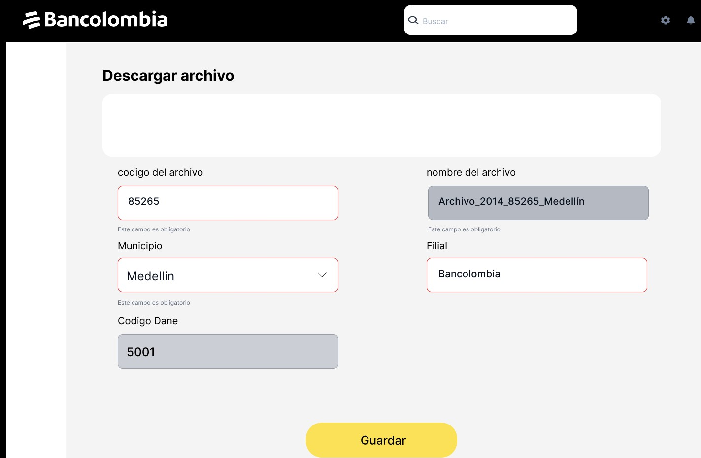
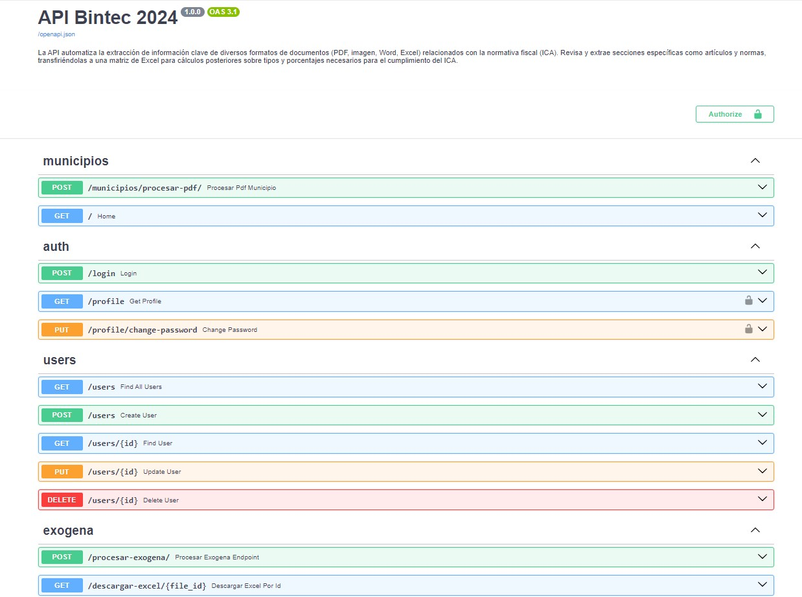
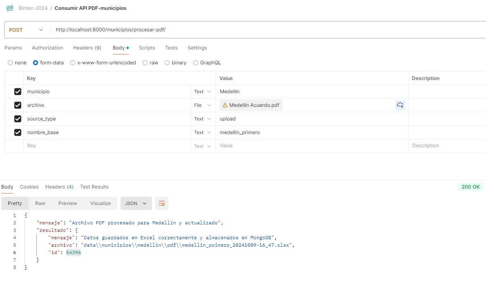

# Reto Bintec 2024


## Descripción del Problema

El problema principal es la extracción manual de información clave desde diferentes formatos de archivos (PDF, imagen, Word, Excel) relacionados con normativas tributarias (ICA). Este proceso manual requiere revisar y extraer secciones específicas, como artículos y normas, para luego trasladar la información a un archivo Excel (matriz) donde se realizan los cálculos de tarifas y porcentajes necesarios para el cumplimiento de la normativa ICA. La información proviene de distintas fuentes, como correos, OneDrive, o descargas de portales, lo que incrementa la complejidad y el tiempo invertido.

## Descripción General

Este proyecto tiene como objetivo automatizar la extracción de información clave de diferentes documentos relacionados con normativas tributarias (ICA). Utiliza FastAPI para crear un backend que permite procesar documentos en formatos PDF, imagen, Word y Excel, y extraer datos necesarios para generar una matriz Excel con cálculos de tarifas y porcentajes.

## MVP



## Arquitectura del Proyecto

- **Backend**: Desarrollado en FastAPI para manejar las peticiones y procesar los documentos.
- **Base de Datos**: MongoDB, para el almacenamiento de datos relacionados con los usuarios y los archivos procesados.
- **OCR**: Tesseract para la extracción de texto de imágenes y PDFs.
- **Procesamiento de Archivos**: Utilización de PyMuPDF para PDF y openpyxl para archivos Excel.

**Estructura básica del proyecto:**
```plaintext
Bintec-2024/
│
├── app/
│   ├── config/
│   ├── models/
│   ├── routers/
│   ├── schemas/
│   ├── services/
│   ├── utils/
│   └── main.py
├── data/
│   ├── municipios/
├── images
├── tests
├── Readme.md
└── requirements.txt
```
## Prerequisitos

- Python 3.9+

## Clonar el proyecto

```
git clone https://github.com/lriveraBanco/Bintec
```

## Configuración el proyecto

Seleccionar el proyecto : Moverse al directorio principal

```
cd Bintec-2024
```

### Crear entorno virtual

```
python3 -m venv venv
```

### Activar entorno virtual

**Para Linux/MacOS**
```
source venv/bin/activate
```

**En Windows:**
```
venv\Scripts\activate
```
### Instalar dependencias

```
pip install -r requirements.txt
```

### Ejecutar servidor

```
uvicorn app.main:app --reload
```

## Documentación del API

**Desde aquí podrias ver la documentación y consumir el API ingresa a la sigueinte url:**
```
http://127.0.0.1:8000/docs
```



## Consumir API desde Postman

Si quieres consumir el API desde postman solo debes descargar la colección puedes hacerlo desde el siguiente link:

[Descargar Postman Collection](images/Bintec-2024.postman_collection.json)

Una vez descargada, puedes importar la colección en Postman y empezar a realizar las solicitudes de la API fácilmente.



## Contribuciones

**Si deseas contribuir a este proyecto, sigue estos pasos:**

1. Haz un fork del repositorio.
2. Crea una nueva rama (`git checkout -b feature-nueva-funcionalidad`).
3. Realiza tus cambios y haz commit (`git commit -m 'Agrega nueva funcionalidad'`).
4. Sube los cambios a la rama (`git push origin feature-nueva-funcionalidad`).
5. Abre un Pull Request.

## Licencia

Este proyecto está licenciado bajo la Licencia MIT. Consulta el archivo LICENSE para más detalles.

## Contacto

Leandro Rivera: <lrivera@bancolombia.com.co>
